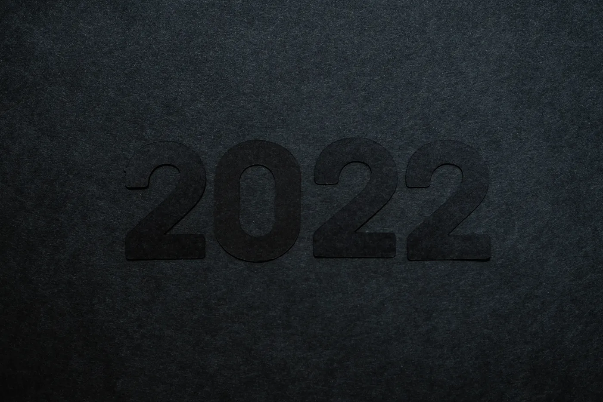

#### First
I bought land to build my house. That was huge for me because now I have a place to make my home with everything I need to create my dreams, like my music studio. I can also chill with friends, have kids, and play with them.
#### Second
I moved to the capital, Brasilia, which was one of the things I had as a resolution for 2022. I lived in a small city far away from my friends, to give you an idea, I had to travel to my best friend’s house for four hours. Now it is less than one hour, and I have all the benefits of living in a big city like Cine, malls (in Brazil, we call shopping), and education. I want to go back to college or start to study music.
#### Third
I made good money as a software developer and started investing. I spent a lot of time learning about investing in 2022 and am still learning. Multiplying income is not easy, but I have a small start and plan to grow it in 2023.
#### Fourth
I got to the gym. At thirty years old, I have started to notice my body ageing: belly fat, tiredness, and ageing skin. So, I started working out, but I still need to get more serious.
#### Fifth
I was laid off from one of my contracts, half of my income. But I recovered quickly, and the situation changed my mind. Now, I am desperate to earn a passive income. Being dependent on a company is not a smart idea. It doesn’t matter whether the company is good or bad. A country's economy can change direction without notice.
#### Sixth
I got divorced. After eight years, I am single again, and sometimes I have bad moments; it is not easy to deal with that. But, with time, I believe this emptiness and sadness will be gone. Right now, I feel terrible because I have a whole history with my ex, and both were happy together, but I disconnected from her, and as a result, we had to continue on different paths. We did everything to save our marriage, and it didn’t work. I wish I could do it differently.
#### Seventh
I started with therapy. Unfortunately, I didn’t have the best parents, and as a result, I have struggled all my life to deal with my feelings and to understand who I am. That made me suffer. I was taught that men could not cry, show emotions, or even make friends and that I should be a rock! The reality, I’ll never be something like that. With therapy, I understood how to deal with all these things.
#### Conclusion
2022 wasn’t my best year, but I have learned a lot, especially about my feelings and how life can be more complicated. I’ll never give up, and I still have dreams I want to achieve. For 2023, I’ll do my best; I’ll put into practice everything I have learned in the last year, and I hope you can see it. 